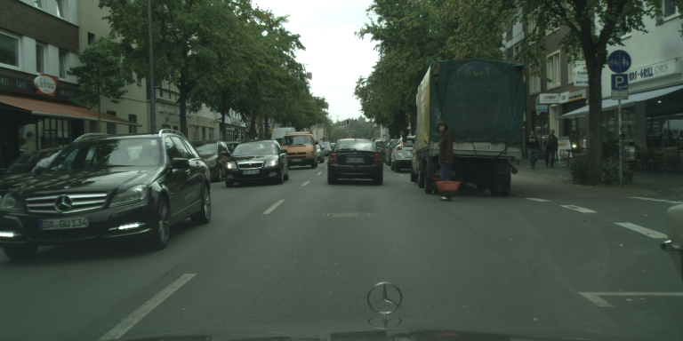
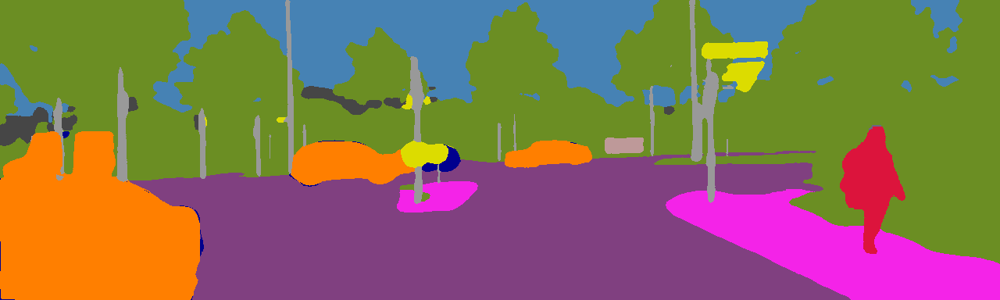

# SMSnet:  Semantic  Motion  Segmentation Using  Deep  Convolutional  Neural  Networks
SMSnet is a deep learning model for semantic motion segmentation, where the goal is to assign semantic labels as well as motion labels (moving or static) to every pixel in the input image. SMSnet is easily trainable on a single GPU with 12 GB of memory and has a fast inference time. SMSnet is benchmarked on Cityscapes and KITTI datasets.

This repository contains our TensorFlow implementation of SMSnet which allows you to train your own model on any dataset and evaluate the results in terms of the mean IoU metric.

If you find the code useful for your research, please consider citing our paper:
```
@inproceedings{vertens2017smsnet,
  title={SMSnet: Semantic Motion Segmentation Using Deep Convolutional Neural Networks},
  author={Vertens, Johan and Valada, Abhinav and Burgard, Wolfram},
  booktitle={IEEE/RSJ International Conference on Intelligent Robots and Systems (IROS)},
  pages={582--589},
  year={2017},
  organization={IEEE}
}
```

## Live Demo
http://deepmotion.cs.uni-freiburg.de

## Example Motion Segmentation Results

| Dataset       | RGB_Image     | Optical_Flow_Image| Motion_Segmented_Image|
| ------------- | ------------- | -------------  | -------------  |
| Cityscapes    | |  | |
| Kitti  |   | | |

## Contacts
* [Abhinav Valada](http://www2.informatik.uni-freiburg.de/~valada)
* [Rohit Mohan](https://github.com/mohan1914)

## System Requirements

#### Programming Language
```
Python 2.7
```

#### Python Packages
```
tensorflow-gpu 1.4.0
```

## Configure the Network
#### Data
* Flow Computation
  - Compute the optical flow for the dataset using [FlowNet3](https://github.com/lmb-freiburg/netdef_models/tree/master/FlowNet3) network.
  - Compute the ego flow as described in the [paper](http://ais.informatik.uni-freiburg.de/publications/papers/valada17iros.pdf).
  - For the final flow image, we first take the difference between optical (flow,ego flow) and store it as a 3 channel uint8 image. The first 2 channels contains normalized u and v and the last channel contains the normalized magnitude of u and v.
  - In our work, we multiply u and v with scale = 6.4 and add 128 to obtain normalized u and v. Also, we multiply magnitude(u,v) with 12.75 to obtain the normalized magnitude and clip any value not in between (0,255). 
  
* Augment the training data.
  In our work, we first resized the images in the dataset to 768x384 pixels and then apply a series of augmentations (random_flip, random_scale and random_crop).

* It is assumed that the RGB image folder name is image_data, GroundTruth image folder name is label_data and FLOW image folder name is flow_data. It is also assumed that all the images are saved as .png format. If you have different file structure, you'll have to modify dataset/helper_sms.py as per your requirement.
  (Input to the model is in BGR and 'NHWC' form)
 
* Class Ids:
  - 0: void
  - 1: static
  - 2: moving
  
 #### Training Params
```
    gpu_id: id of gpu to be used
    model: name of the model
    num_classes: number of classes
    intialize:  path to pre-trained model
    checkpoint: path to save model
    train_data: path to rgb image dataset
    batch_size: training batch size
    skip_step: how many steps to print loss 
    height: height of input image
    width: width of input image
    max_iteration: how many iterations to train
    learning_rate: initial learning rate
    save_step: how many steps to save the model
    power: parameter for poly learning rate
    mean: path to mean file
    ignore_label: True for ignoring void labels
```

#### Evaluation Params
```
    gpu_id: id of gpu to be used
    model: name of the model
    num_classes: number of classes
    checkpoint: path to saved model
    test_data: path to dataset .tfrecords
    batch_size: evaluation batch size
    skip_step: how many steps to print mIoU
    height: height of input image
    width: width of input image
    mean: path to mean file 
```

## Training and Evaluation

#### Training Procedure
Edit the config file for training in config folder.
Run:
```
python train.py -c config/train.config or python train.py --config config/train.config
```

#### Evaluation Procedure

Select a checkpoint to test/validate your model in terms of the mean IoU metric.
Edit the config file for evaluation in config folder. Run:
```
python evaluate.py -c config/test.config or python evaluate.py --config/test.config
```
## Additional Notes:
   * During evaluation we consider only movable objects regions (such as cars) in the image and ignore background regions (such as building, sky etc.). Therefore, during evaluation the ground truth should be void (id: 0) for all background objects.  
   
## License
For academic usage, the code is released under the [GPLv3](https://www.gnu.org/licenses/gpl-3.0.en.html) license. For any commercial purpose, please contact the authors.
